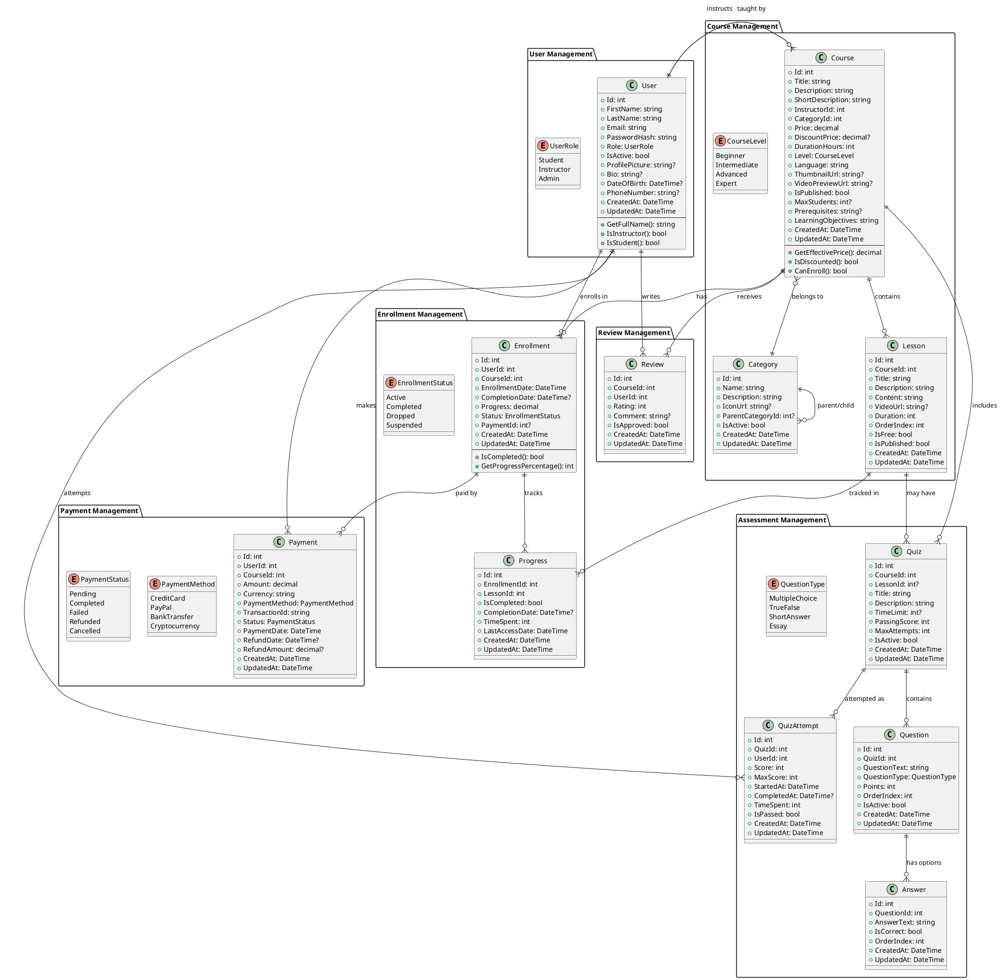

# Learnify.ai API - Class Diagram and Domain Model

## Class Diagram (PlantUML)

## Domain Model Overview

### Core Entities

1. **User**: Represents all users (students, instructors, admins)
2. **Course**: Main learning content with metadata
3. **Category**: Course categorization and organization
4. **Lesson**: Individual learning units within courses
5. **Enrollment**: User-course relationship tracking
6. **Progress**: Detailed progress tracking per lesson
7. **Quiz/Question/Answer**: Assessment system
8. **QuizAttempt**: User quiz attempt tracking
9. **Payment**: Financial transactions
10. **Review**: Course feedback and ratings

### Key Relationships

- **User ? Course**: Many-to-many through Enrollment
- **User ? Course**: One-to-many (Instructor relationship)
- **Course ? Lesson**: One-to-many composition
- **Course ? Category**: Many-to-one
- **Enrollment ? Progress**: One-to-many
- **Quiz ? Question ? Answer**: Hierarchical structure

### Business Rules

1. **Enrollment**: Users can enroll in multiple courses
2. **Progress**: Tracked per lesson per enrollment
3. **Payments**: Required for paid courses
4. **Reviews**: Only enrolled users can review
5. **Quizzes**: Can be course-level or lesson-specific
6. **Categories**: Support hierarchical structure

## Implementation Strategy

1. **Phase 1**: Extend existing User and Course models
2. **Phase 2**: Add core relationship entities (Enrollment, Category)
3. **Phase 3**: Implement assessment system
4. **Phase 4**: Add payment and review systems

This diagram provides a comprehensive foundation for a learning management system that can scale with your business needs.